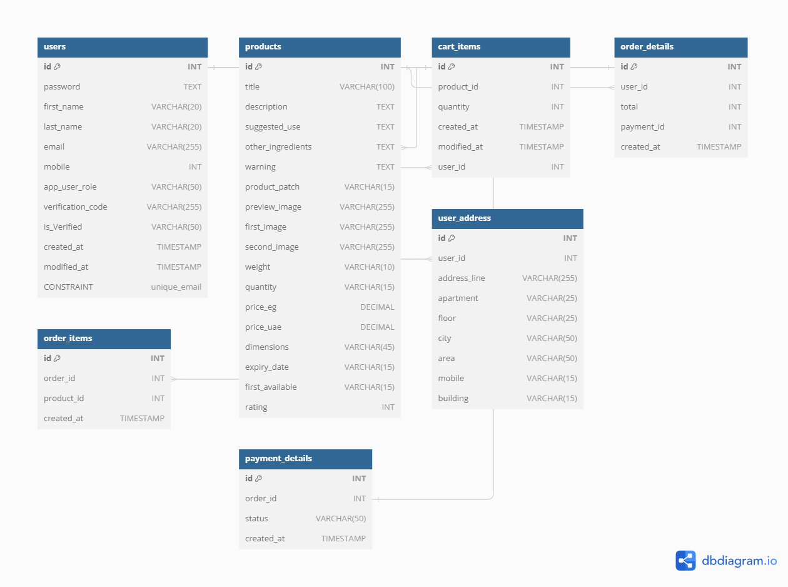
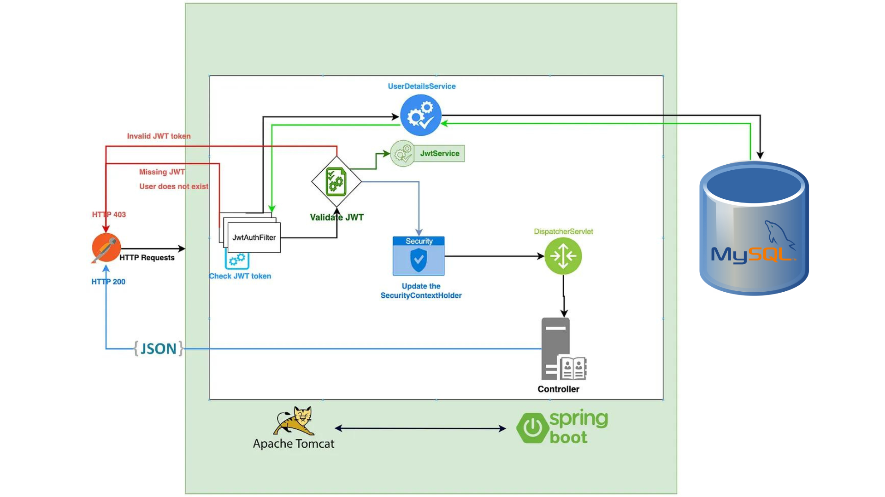
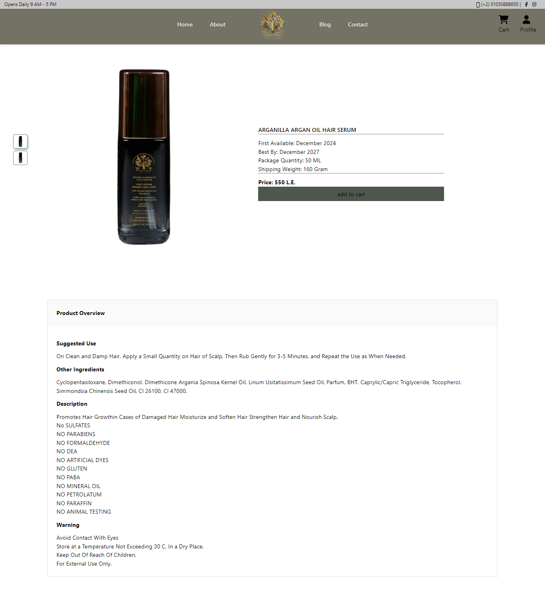
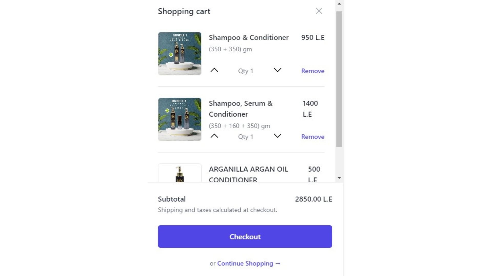
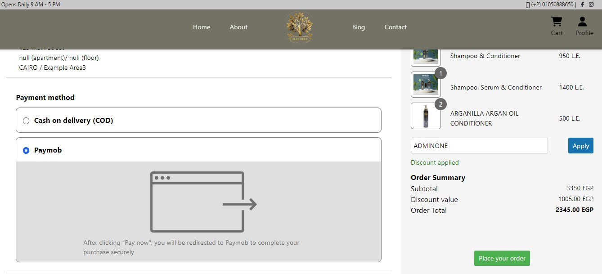
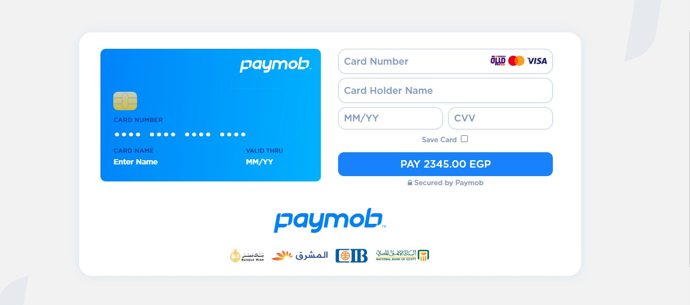
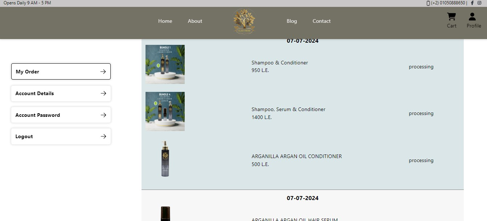
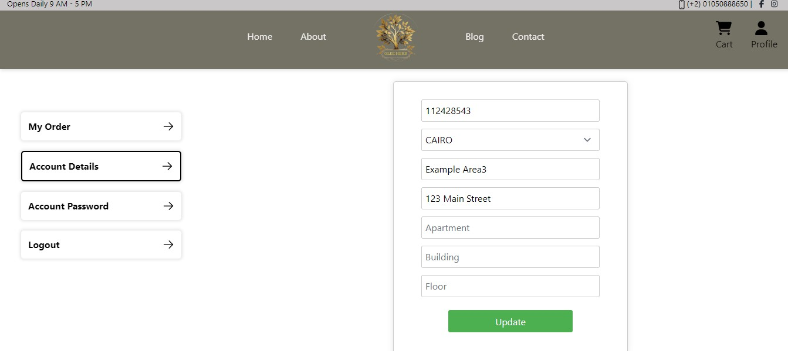

# Glee Herb E-commerce Site

**Full Stack: Java Spring Boot, MySQL, React**

## Overview

Glee Herb is a full-fledged e-commerce platform that showcases my expertise in full-stack development. The site is built using Java Spring Boot for the backend, MySQL for database management, and React for the frontend. Key features include:

## Features

- **User Authentication**: Secure login and signup functionality with JWT.
- **Product Display**: Dynamic product listing and detailed views.
- **Shopping Cart**: Persistent cart functionality for both logged-in users and guests.
- **Order Management**: Personalized dashboards for users to manage their orders.
- **Payment Integration**: Secure payment processing using Paymob API.
- **Checkout Discounts**: Discounts applied at the time of checkout.

## Screenshots

- Database Tables  
  
- Authentication Process  
  
- Product Display  
  
- Shopping Cart  
  
- Checkout Page  
  
- Payment Page  
  
- Order Management Dashboard  
  
- User Fetched Data  
  

## Getting Started

### Prerequisites

- **Node.js**: Make sure you have Node.js installed. You can download it from [here](https://nodejs.org/).
- **Java**: Ensure you have Java installed. You can download it from [here](https://www.oracle.com/java/technologies/javase-jdk11-downloads.html).
- **MySQL**: You need MySQL installed and running. Download it from [here](https://www.mysql.com/downloads/).

### Installation

git clone https://github.com/Mohamed5828/gleeherb.git
cd gleeherb/backend
./mvnw clean install
./mvnw spring-boot:run
cd ../frontend
npm install
npm start

### Paymob Integration

aymob integration involves making three API calls, each with specific data objects. Detailed instructions on integrating Paymob are available in the official Paymob documentation.

## Project Structure

### Backend

- **Java Spring Boot application**
  - `/Gle/src/main/java` - Main application code
  - `/Gle/src/main/resources` - Configuration files

### Frontend

- **React application**
  - `/src` - Main application code
  - `/public` - Public assets
  - `/build` - Frontend build output

## Contributing

Feel free to fork the project and submit pull requests. For major changes, please open an issue to discuss what you would like to change.

## Contact

[mohamed.ahmed5828@gmail.com](mailto:mohamed.ahmed5828@gmail.com)

Project Link: [https://github.com/Mohamed5828/gleeherb.git](https://github.com/Mohamed5828/gleeherb.git)
